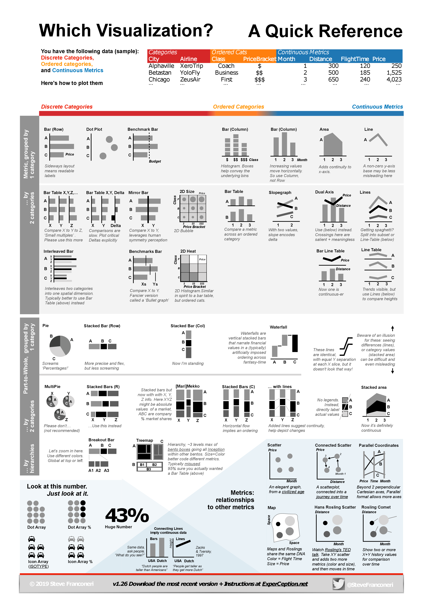

# Intro to Data Analysis 

## Why visualize data? 

There are two major reasons we want to visualize our data:
* Exploratory data analysis (getting to know our own data)
* Story-telling (helping others get to know our data)

Using graphics to explore your own data is a best practice
* In quantitative analysis, focus on statistical significance can blind us to
the real findings, and can cause inadvertent “p-hacking”
* In qualitative analysis, the huge scope of the data (and often inductive
nature of the research) can lead to a similar phenomenon: “cherrypicking”
of particular quotations or events that support one’s arguments

## Choosing visualization type

.

Source: http://experception.net/Franconeri_ExperCeptionDotNet_DataVisQuickRef.pdf
